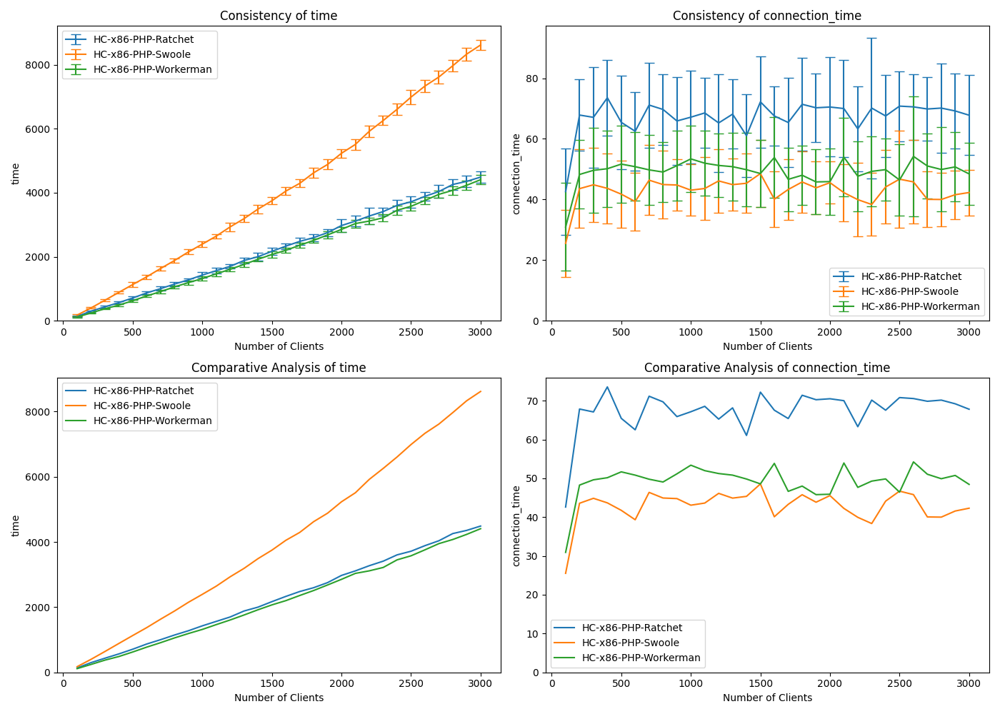
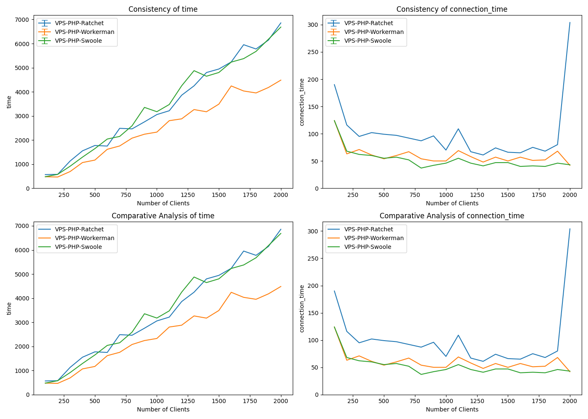
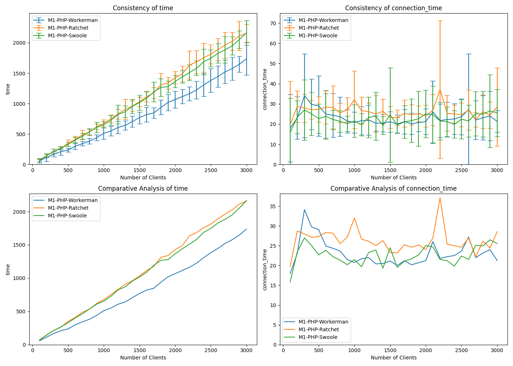

# PHP Websocket Benchmark Server (Docker)

Based on [PHP (Ratchet)](https://github.com/matttomasetti/PHP-Ratchet_Websocket-Benchmark-Server) repository, and
[Websocket Performance Comparison](https://matttomasetti.medium.com/websocket-performance-comparison-10dc89367055) article,
implemented few PHP Websocket servers to be compared with each other and other technologies (languages).

* Ratchet is from the original repository, but moved to a subfolder.
* OpenSwoole is widely used but turned out to be almost as slow as Ratchet.
* **Workerman** is super fast.


## Benchmarking client

The benchmarking client can be found [here](https://github.com/wiz00/Websocket-Benchmark-Client)

## Install & run

### Ratchet PHP websocket server

```bash
docker build . -f Dockerfile.Ratchet -t websocket_benchmark/php-ratchet && \
docker run --rm -p 8080:8080 websocket_benchmark/php-ratchet
```

or

```bash
./start-ratchet.sh
```

### OpenSwoole PHP websocket server

```bash
docker build . -f Dockerfile.Swoole -t websocket_benchmark/php-swoole && \
docker run --rm -p 8080:8080 websocket_benchmark/php-swoole
```

or

```bash
./start-swoole.sh
```

### Workerman PHP websocket server

```bash
docker build . -f Dockerfile.Workerman -t websocket_benchmark/php-workerman && \
docker run --rm -p 8080:8080 websocket_benchmark/php-workerman
```

or

```bash
./start-workerman.sh
```

## Comparison of PHP websocket servers performance

Tested on a Hetzner Cloud server instance CPX11 (2 vCPU x86 AMD EPYC™️ 7002 series, 2 GB RAM) scoring 976 points in [Geekbench 5 Single-Core test](https://browser.geekbench.com/v5/cpu/22659970) (tests run using Docker containers).



This particular test was run on localhost using this [benchmarking client](https://github.com/wiz00/Websocket-Benchmark-Client) and these settings:

| Parameter | Value |
| --- | --- |
| Number of test repetitions | 20 |
| Number of rounds per repetition | 30 |
| Connections to be added per round | 100 |
| Requests each connection makes per round | 100 |

So the test is started with 100 connections sending 10k requests in total and ended up with 3000 connections sending 300k in total per round, and was repeated 20 times.

In the result, Workerman is insignificantly faster that Ratchet, and OpenSwoole turned out to be slow.

----

Also tested on a Hetzner Cloud server instance CX22 (2 vCPU x86 Intel® Xeon® Gold, 4 GB RAM) scoring 652 points in [Geekbench 5 Single-Core test](https://browser.geekbench.com/v5/cpu/22659914) (tests run using Docker containers) but with only 1 repetition of 20 rounds (because the instance if painfully slow).



I mention this test only because of Ratchet performance which is different from the main test.

----

The same happens on 2021 MacBook Pro 16" (M1 Pro - Arm SoC), my daily driver:



Despite the fact that each test had 20 repetitions here, the results aren't consistent, because I have *a lot* happening on the device. But the overall picture is clear.

I'm not sure what happened to Ratchet in those tests. My personal favorite is Workerman which I've been using in production for years.

## Other websocket servers

* [Node](https://github.com/wiz00/Websocket-Benchmark-Node)
* [Python](https://github.com/wiz00/Websocket-Benchmark-Python)
* [PHP](https://github.com/wiz00/Websocket-Benchmark-PHP) (current)
* [Go](https://github.com/wiz00/Websocket-Benchmark-Go)

## Original comparison

* [Websocket Performance Comparison](https://matttomasetti.medium.com/websocket-performance-comparison-10dc89367055)
* [Technical Report](https://www.researchgate.net/publication/348993267_An_Analysis_of_the_Performance_of_Websockets_in_Various_Programming_Languages_and_Libraries)

## Original GitHub repositories

* [Benchmarking Client (NodeJS)](https://github.com/matttomasetti/NodeJS_Websocket-Benchmark-Client)
* [C (LWS)](https://github.com/matttomasetti/C-LWS_Websocket-Benchmark-Server)
* [C++ (uWS)](https://github.com/matttomasetti/CPP-uWS_Websocket-Benchmark-Server)
* [C# (Fleck)](https://github.com/matttomasetti/CS-Fleck_Websocket-Benchmark-Server)
* [Go (Gorilla)](https://github.com/matttomasetti/Go-Gorilla_Websocket-Benchmark-Server)
* [Java (WebSocket)](https://github.com/matttomasetti/Java-WebSocket_Websocket-Benchmark-Server)
* [NodeJS (uWS)](https://github.com/matttomasetti/NodeJS-uWS_Websocket-Benchmark-Server)
* [PHP (Ratchet)](https://github.com/matttomasetti/PHP-Ratchet_Websocket-Benchmark-Server)
* [Python (Websockets)](https://github.com/matttomasetti/Python-Websockets_Websocket-Benchmark-Server)
* [Python (Autobahn)](https://github.com/matttomasetti/Python-Autobahn_Websocket-Benchmark-Server)
* [Python (Aiohttp)](https://github.com/matttomasetti/Python-Aiohttp_Websocket-Benchmark-Server)
* [Rust (WebSocket)](https://github.com/matttomasetti/Rust-WebSocket_Websocket-Benchmark-Server)
